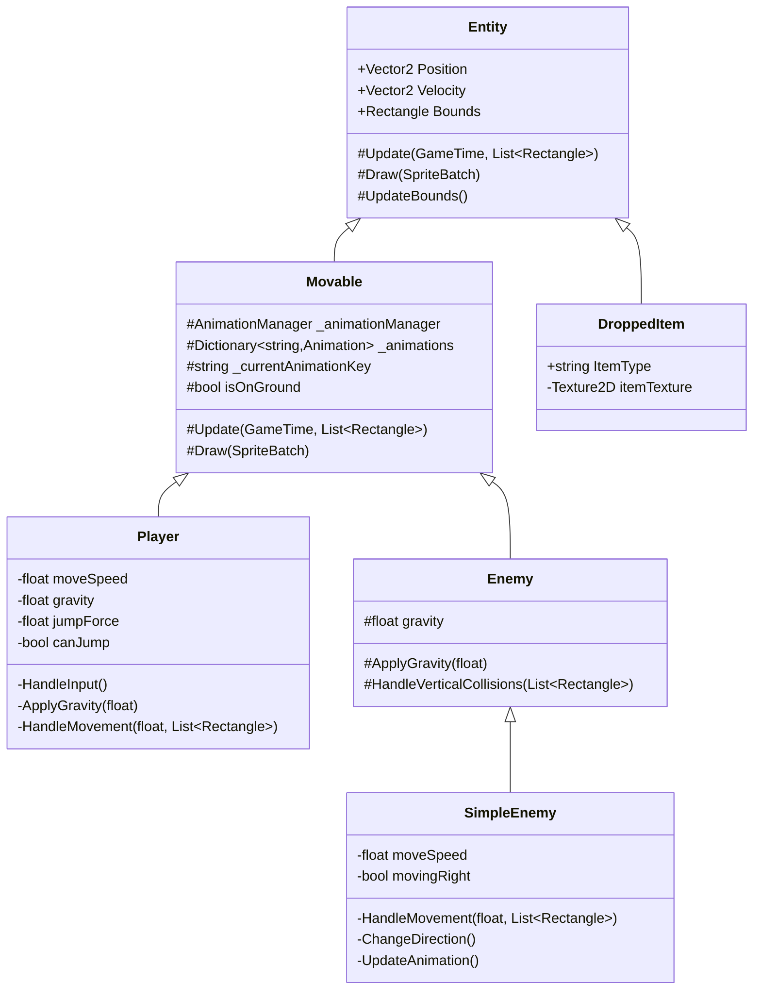

# 2D Platformer Game Project

A 2D platformer game engine developed with MonoGame framework, featuring entity component system, animated sprites, and tile-based level design.

## Project Structure

```
FinalProject/
├── Content/                # Game assets
│   ├── Textures/          # Images and sprites
│   ├── Maps/              # Level collision data
│   └── Content.mgcb       # MonoGame content pipeline
├── GameObject/            # Game objects and components
│   ├── Entity/           # Entities with physics
│   ├── Animation/        # Sprite animation system  
│   └── Camera.cs         # Game camera
├── Map.cs                # Level management
└── Singleton.cs          # Global state
```

## Class Hierarchy



## Core Systems

### Entity System
The game uses a three-layer entity system:
- `Entity`: Base class with position, collision, and physics
- `Movable`: Adds animation support and movement
- `Player/Enemy`: Specific implementations

Creating a new entity type:
```csharp
public class NewEntity : Movable
{
    public NewEntity(Dictionary<string, Animation> animations, Vector2 position) 
        : base(animations, position)
    {
        // Initialize entity
    }

    public override void Update(GameTime gameTime, List<Rectangle> platforms)
    {
        // Add behavior
        base.Update(gameTime, platforms);
    }
}
```

### Animation System
Handles sprite animations from sprite sheets:

1. Add sprite sheet to Content project
2. Define animation parameters:
```csharp
var animations = new Dictionary<string, Animation>
{
    { "Idle", new Animation(texture, frameWidth, frameHeight, frameCount, frameSpeed) }
};
```

### Level Design
Levels use a simple text-based collision system:
- `1`: Solid block
- `0`: Empty space

Example level file (`Maps/level.txt`):
```
111111
100001
100001
111111
```

Load level:
```csharp
mapManager.AddMap("Level1", texture, position, "Content/Maps/level.txt");
```

## Adding Content

### New Enemy Types
1. Create class inheriting from `Enemy`
2. Implement movement/behavior in `Update()`
3. Add collision handling
4. Register animations

### New Levels
1. Create collision map text file
2. Add background texture
3. Register in `MainScene.cs`

### New Animations
1. Add sprite sheet to Content
2. Define animation parameters
3. Add to entity's animation dictionary

### Dropped Items
Items inherit directly from `Entity` since they don't need animations:

```csharp
public class DroppedItem : Entity 
{
    private Texture2D itemTexture;
    public string ItemType { get; private set; }

    public DroppedItem(Texture2D texture, Vector2 position, string type) 
        : base(position)
    {
        itemTexture = texture;
        ItemType = type;
        // Set bounds based on texture size
        Bounds = new Rectangle((int)position.X, (int)position.Y, 
                             texture.Width, texture.Height);
    }

    public override void Draw(SpriteBatch spriteBatch)
    {
        spriteBatch.Draw(itemTexture, Position, Color.White);
        base.Draw(spriteBatch); // Draws debug bounds
    }
}
```

Usage:
1. Create texture in Content project
2. Load texture in MainScene:
```csharp
Texture2D coinTexture = Content.Load<Texture2D>("coin");
var coin = new DroppedItem(coinTexture, position, "Coin");
```

Best practices for items:
- Keep textures small and consistent in size
- Use simple collision detection
- Consider adding bobbing animation or glow effects
- Implement pickup radius
- Add despawn timer if needed

## Debugging

Enable debug visualization in `Singleton.cs`:
```csharp
public bool ShowDebugInfo { get; set; } = true;
```

Shows:
- Collision boxes
- Platform boundaries
- Entity states

## Camera System

Camera follows player with configurable:
- Zoom level
- Follow speed
- Screen bounds

## Best Practices

1. Entity Creation
- Inherit from appropriate base class
- Initialize in constructor
- Override Update for behavior

2. Collisions
- Use HandleMovement for physics
- Check platform collisions
- Update bounds after movement

3. Animations
- Use consistent frame sizes
- Initialize all animations in constructor
- Update animation state in Update

4. Performance
- Use object pooling for multiple entities
- Only update visible objects
- Batch similar draw calls
